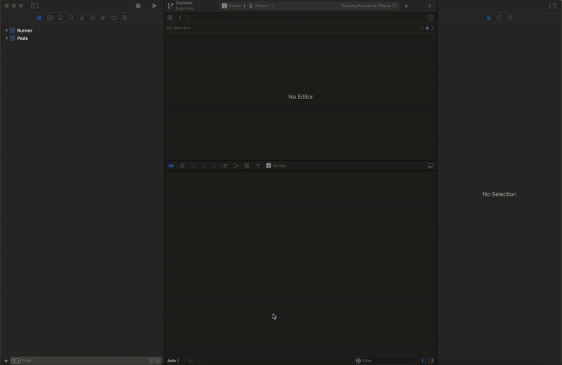

# Nouns AR Lab

Nouns AR Lab is an application that combines the concept of youtube short and camera kit sdk from snapchat, this application is like a portfolio that displays a video using an AR effect, and there are actions to use the AR effect in the application

## Instalation

To install the Flutter project, follow these steps:

1. Make sure you have Flutter SDK installed on your machine. If not, you can download it from the official Flutter website.

2. Clone the project repository using the following command:
    ```bash
    git clone https://github.com/fahmad480/NounsDaoAR
    ```

3. Navigate to the project directory:
    ```bash
    cd NounsDaoAR
    ```

4. Run the following command to fetch the project dependencies:
    ```bash
    flutter pub get
    ```

5. For iOS, follow this step first before go to step 7
    ```bash
    cd ios
    pod install
    ```

6. Open xcode workspace inside ios folder

7. Connect your device or start an emulator.

8. Run the project using the following command:
    ```bash
    flutter run
    ```

This will start the Flutter project on your device or emulator.

## Android Setup

nothing, just follow the above steps

## Enable Localization for CameraKit for iOS

To enable localization for CameraKit, follow these steps:

1. Open the `Localizable.strings` file located at `Pods Project -> Pods -> SCCameraKitReferenceUI -> Resources -> Localizable.strings`.

2. Make sure the `SCCameraKitReferenceUI` target is selected in the "Target Membership" section on the right side of Xcode.

3. Build the project to apply the changes.


